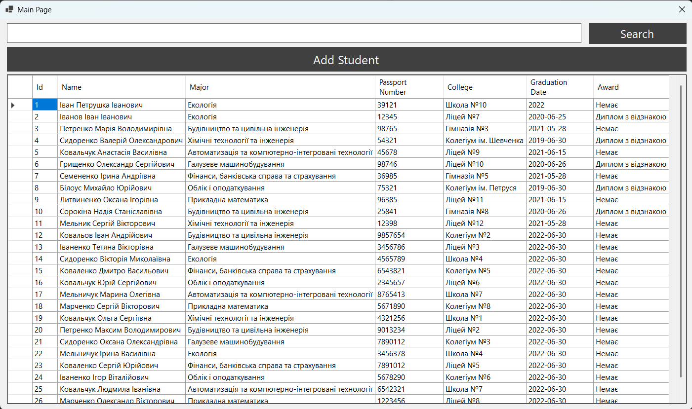
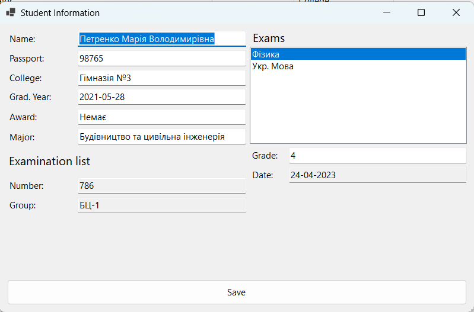
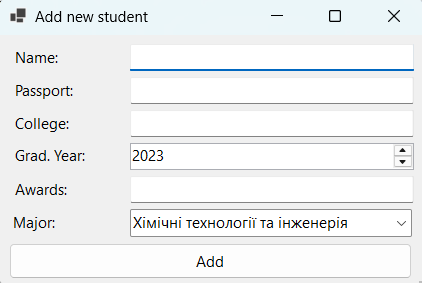

# CollegeReception 2023

CollegeReception is a Windows Forms application built with C# .NET 6 and SQLite for managing college admissions student data. It allows viewing students, searching by criteria, adding new students, and viewing detailed exam information.

## ✨ Key Features

- **Student Table**: Displays list with JOIN on specialities (Id, name, major, passport, education, graduation date, awards).
- **Full-text Search**: Filters across **all fields** — name, major, passport, education, graduation date, or award (parameterized LIKE queries).
- **Add Students**: Form with speciality ComboBox, parameterized INSERT.
- **Student Details**: Double-click opens form with exams, dates, and grades (compares exam date to current date).

## 🚀 Quick Start

**Build**:
   ```
   cd CollegeReception
   dotnet restore
   dotnet build
   ```

**Run**:
   ```
   dotnet run
   ```

**Test**:
   - Add students via ADD button.
   - **Search by any field** (name, passport, major, etc.).
   - Double-click to see exams and grades.

## 📱 Screenshots

### Landing Page  
  
Main Page with data in ukrainian language

  
Student Information page with exams results

  
Add New Student Page 

## 🛠️ Tech Stack

| Component | Version/Tool |
|-----------|--------------|
| Framework | .NET 6.0-windows |
| UI | Windows Forms, DataGridView |
| Database | SQLite (System.Data.SQLite 1.0.117) |
| ORM (opt.) | Entity Framework Core SQLite |